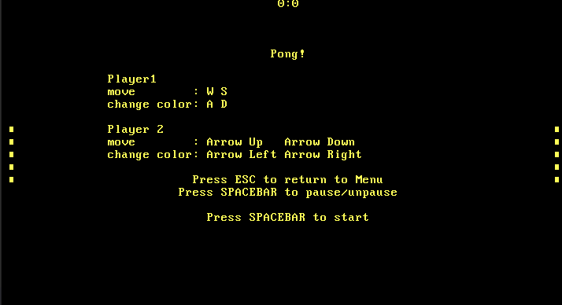
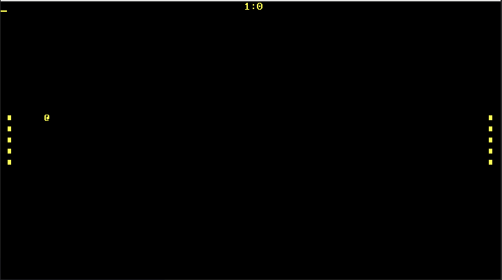

# Pong

Runs pong on an x86_64-unknown-none target.

Inspired by the amazing [Writing an OS in Rust](https://os.phil-opp.com/) series

## Usage

install `cargo bootimage`

run `cargo bootimage`

run `qemu-system-x86_64 -drive format=raw,file="target\x86_64-atiw\debug\bootimage-pong.bin"`

### Menu:

### Running State:

## Reasons for creating

We had to create a project for school and I wanted to work through the Writing an OS in Rust series,  
so I used the opportunity to familiarize myself with `no-std` rust.
